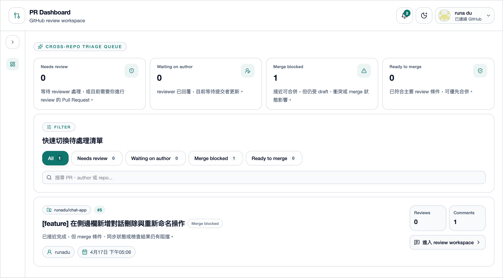
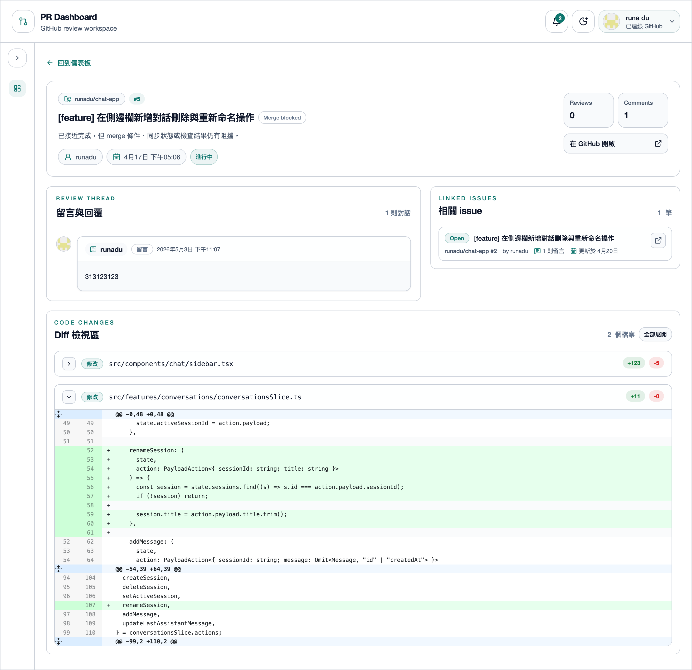
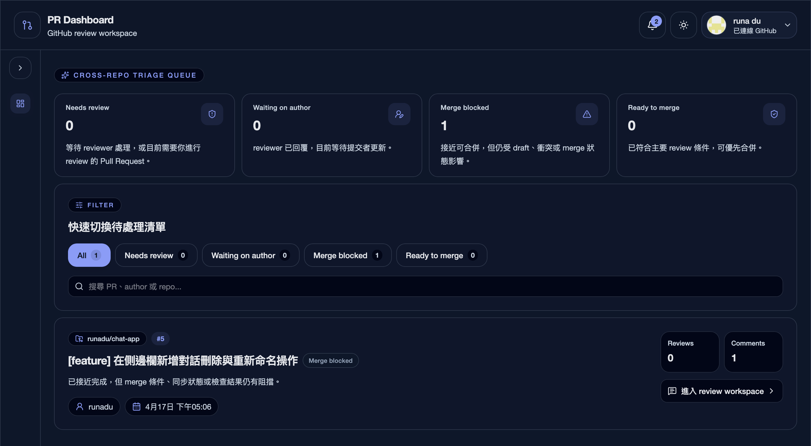
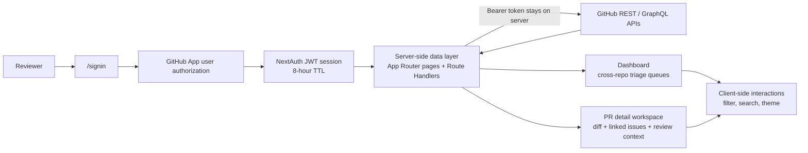

# PR Dashboard

PR Dashboard 是一個為 GitHub code review 設計的 cross-repo workspace，讓 reviewer 能在單一介面完成 PR triage、查看 review context、閱讀 diff，減少在多個 repository 與 GitHub 頁面之間切換的成本。

## 前言

在多個 repository 同時 review 時，真正耗時間的通常不是看 code，而是反覆切換頁面、整理優先順序、補齊每個 Pull Request 的脈絡。這個專案的目標，是把這些分散的 review 工作收斂成一個可操作的 Dashboard。

想解決的問題：

- reviewer 很難快速知道「現在最該先看哪幾個 PR」
- PR context 散落在 diff、linked issues、review thread 與不同 repository 頁面之間
- GitHub 原生介面對 cross-repo daily triage 不夠集中

## 專案功能

- 在同一個 Dashboard 聚合多個 repository 的 Pull Request
- 以 `Needs review`、`Waiting on author`、`Merge blocked`、`Ready to merge` 四個視角整理 review queue
- 提供 queue 統計、關鍵字搜尋與篩選，縮短找出重點 PR 的時間
- 在 PR detail 頁整合 linked issues、review thread、diff 與唯讀留言
- 支援深色與淺色模式，方便長時間審查閱讀
- 透過 GitHub App user authorization 載入使用者有權限存取的資料

## 畫面預覽

### Dashboard 總覽

跨 repository 的 PR triage 主畫面，集中呈現 queue 狀態、搜尋與篩選，方便 reviewer 先處理當前最重要的項目。


### PR 詳細頁面

將 diff、linked issues 與 review context 收斂在同一個頁面，減少在 GitHub 多個頁面之間切換的成本。


### 深色模式檢視



## 架構流程



GitHub access token 只在 server side 使用，client 端只接收渲染所需的資料與互動狀態。

## 技術亮點

- 使用 Next.js 16 App Router，將已授權資料的讀取維持在 server side
- 使用 NextAuth JWT session strategy，GitHub access token 僅在 server 端取用，不暴露到 client-visible session data
- 用明確的 triage model 將跨 repo PR 分類成四種 queue state，方便 reviewer 先處理高優先事項
- diff viewer 採用 `full`、`patch`、`binary / oversized / unavailable fallback` 的分層策略，避免只靠單一顯示模式
- client components 主要處理互動狀態，像是 filter、search、theme 與目前選取項目；資料讀取優先留在 server side

## 技術堆疊

- Next.js 16 App Router
- React 19
- TypeScript
- Tailwind CSS 4
- NextAuth
- Redux Toolkit
- Vitest

## 目前限制與取捨

- comments 目前是 read-only；若要發表 review 意見或回覆，仍需回到 GitHub 原始 Pull Request
- 目前沒有獨立的 Issues workspace，issue 脈絡只存在於 PR detail 的 linked issues panel
- 自動化測試目前主要覆蓋 diff 呈現相關的純邏輯，尚未補齊 GitHub API、auth flow 與 page-level integration tests
- 要完整體驗功能，需要自行建立 GitHub App 並安裝到對應的 account / organization / repositories

## 本地開發設定

### 環境需求

- Node.js 20+
- npm
- GitHub App

### 1. 建立 GitHub App

請先到 GitHub 建立 GitHub App：

```text
GitHub Settings → Developer settings → GitHub Apps → New GitHub App
```

本地開發建議設定：

```text
Homepage URL: http://localhost:3000
Callback URL: http://localhost:3000/api/auth/callback/github
```

Repository permissions 建議至少開啟：

```text
Pull requests: Read-only
Issues: Read-only
Metadata: Read-only
```

建立完成後，請產生 GitHub App 的 Client Secret。

> 這個專案目前使用 GitHub App 的 user access token web flow。
> App 也必須安裝到你要查看的 repositories 上，登入後才看得到對應 PR。
> 目前不使用 GitHub App private key，也不走 installation token server-to-server flow。

### 2. 設定環境變數

複製 `.env.example` 為 `.env.local` 後設定，其中 `GITHUB_APP_CLIENT_ID` 與 `GITHUB_APP_CLIENT_SECRET` 請填入剛建立的 GitHub App credentials：

```bash
GITHUB_APP_CLIENT_ID=your_github_app_client_id
GITHUB_APP_CLIENT_SECRET=your_github_app_client_secret
NEXTAUTH_SECRET=your_random_secret
NEXTAUTH_URL=http://localhost:3000
```

可以用以下指令產生本地開發用的 `NEXTAUTH_SECRET`：

```bash
openssl rand -base64 32
```

### 3. 安裝與啟動

```bash
npm install
npm run dev
```

開啟 [http://localhost:3000](http://localhost:3000)。

## 指令

```bash
npm run dev
npm run lint
npm run test
npm run test:diff
npm run build
npm run start
```

`npm run test` 會執行 Vitest 掃描到的所有 `src/**/*.test.ts`。
若只想做一次性驗證，可以使用：

```bash
npm run test -- --run
```

## 測試

- 使用 Vitest 進行單元測試
- 目前測試主要覆蓋 diff rendering 的純邏輯
- 若未來新增依賴環境變數的測試，建議使用 `.env.test`，不要直接依賴本機的 `.env.local`

## 安全性說明

- 未登入時，首頁會導向 `/signin`
- session 失效或逾時時，會回到登入頁重新授權
- GitHub access token 存放於 NextAuth JWT session token，並只在 server 端取用 GitHub API
- GitHub App user access token 預設有效期約 8 小時，目前 session 壽命與 token 壽命對齊

## 後續可延伸方向

- 補齊 auth flow 與 GitHub API integration tests
- 加入可操作的 review comment / reply flow
- 增加更完整的 reviewer workload 與 queue analytics
